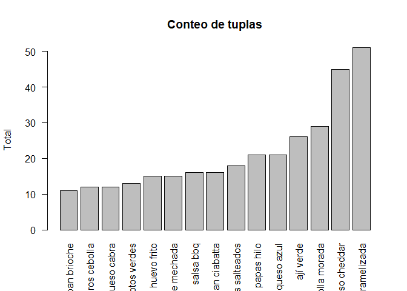

Proyecto 1 - Javier Ramos
================

### Carga de datos

``` r
library(quanteda)
```

    ## Package version: 3.0.0
    ## Unicode version: 10.0
    ## ICU version: 61.1

    ## Parallel computing: 12 of 12 threads used.

    ## See https://quanteda.io for tutorials and examples.

``` r
library(dplyr)
```

    ## 
    ## Attaching package: 'dplyr'

    ## The following objects are masked from 'package:stats':
    ## 
    ##     filter, lag

    ## The following objects are masked from 'package:base':
    ## 
    ##     intersect, setdiff, setequal, union

``` r
library(tidyverse)
```

    ## -- Attaching packages --------------------------------------- tidyverse 1.3.1 --

    ## v ggplot2 3.3.3     v purrr   0.3.4
    ## v tibble  3.1.0     v stringr 1.4.0
    ## v tidyr   1.1.3     v forcats 0.5.1
    ## v readr   1.4.0

    ## -- Conflicts ------------------------------------------ tidyverse_conflicts() --
    ## x dplyr::filter() masks stats::filter()
    ## x dplyr::lag()    masks stats::lag()

``` r
library(utf8)
library(ggplot2)
library(quanteda.textstats)
library(quanteda.textplots)

setwd("D:/UAI/Minería de datos/Proyectos/Proyecto 1")
sanguchez <- read.csv("sanguchez.csv", header = TRUE, sep = ";")
```

### Eliminar datos innecesarios

Se eliminarán aquellas columnas que no entregan datos relevantes como
url, Local y Direccion.

Nota: La variable “texto” sí es capaz de entregar información, pero
escogí eliminarla porque ya me era difícil trabajar con la variable
“ingredientes”

``` r
sanguchez <- sanguchez[,!(colnames(sanguchez) %in% c("url", "Local", "Direccion", "texto"))]
```

Ahora se procederá a eliminar aquellas entidades que contengan datos
vaciós:

``` r
sanguchez <- na.omit(sanguchez)
```

### Análisis de ingredientes parte 1

Se dejan todas las letras en minúsculas:

``` r
sanguchez$Ingredientes <- char_tolower(as.character(sanguchez$Ingredientes))
```

Se procede a separar los textos:

``` r
ing <- tokens(sanguchez$Ingredientes, remove_punct = TRUE, remove_symbols = TRUE, remove_numbers = TRUE)
ing <- tokens_remove(ing, stopwords("es"))
```

Se genera un estudio de tuplas:

``` r
result <- textstat_collocations(ing, size = 2)
```

Notar que a mayor Lambda, mayor es la relación entre las palabras de la
misma tupla. Luego, se dejarán aquellas tuplas que cumplan la condición
de que Lambda &gt;= 5. Además, se escogerán aquellas tuplas que tengan
al menos 10 repeticiones:

``` r
result <- filter(result,result$lambda > 5)
result <- filter(result,result$count > 10)
result <- result[order(result$count),decreasing = FALSE]

barplot(result$count, main = "Conteo de tuplas", ylab = "Total",names.arg = result$collocation, las=2)
```

<!-- -->

### Análisis de ingredientes parte 2

Realizando un copia de la base de datos principal:

``` r
aux <- sanguchez
aux <- tokens(aux$Ingredientes)
#p <- kwic(aux, pattern = phrase(result$collocation[1]))
#p
x <- matrix(data = NA, nrow = length(result$collocation))

for(i in length(result$collocation)){
  p <- kwic(aux, pattern = phrase(result$collocation[[i]]))
  
#p
  if(length(p) > 0) x[i] <- sanguchez$Ingredientes[i]
  
}
length(p)
```

    ## [1] 7

``` r
#y <- matrix(data = NA, nrow = length(result$collocation), ncol = length(aux))

#Se procede a separar en dos columnas las tuplas:
#patron <- '( )'
#ing2 <- strsplit(result$collocation,patron)
```

### Conclusión

Mi objetivo era que a través de las tuplas se pueda ir contando la
cantidad de veces que se encuentran en cada una de las entidades del
dataframe. Luego de eso, con un condicional iría agregando notas a una
matriz de nxm y al final al sumar una columna se conseguiría la suma de
las notas para cada tupla. Luego, los 5 con mayores puntajes pasarían a
través de un proeso similar para determinar el precio a cobrar
(habiendo, claro, limpiado la columnda de precios). Sin embargo, no pude
hacer nada de esto y probé de varias formas pero no me funcioanaba. Esta
vez perdí, pero en la siguiente ganaré.
