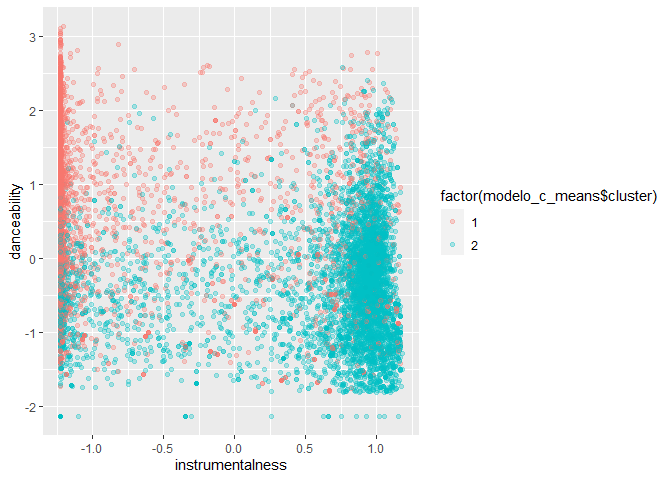

Proyecto 2 - Javier Ramos
================

# Creación de Playlist Spotify

## 1. Carga de data

### 1.1 Librerias

``` r
library(quanteda)
```

    ## Package version: 3.0.0
    ## Unicode version: 10.0
    ## ICU version: 61.1

    ## Parallel computing: 12 of 12 threads used.

    ## See https://quanteda.io for tutorials and examples.

``` r
library(dplyr)
```

    ## 
    ## Attaching package: 'dplyr'

    ## The following objects are masked from 'package:stats':
    ## 
    ##     filter, lag

    ## The following objects are masked from 'package:base':
    ## 
    ##     intersect, setdiff, setequal, union

``` r
library(tidyverse)
```

    ## -- Attaching packages --------------------------------------- tidyverse 1.3.1 --

    ## v ggplot2 3.3.3     v purrr   0.3.4
    ## v tibble  3.1.0     v stringr 1.4.0
    ## v tidyr   1.1.3     v forcats 0.5.1
    ## v readr   1.4.0

    ## -- Conflicts ------------------------------------------ tidyverse_conflicts() --
    ## x dplyr::filter() masks stats::filter()
    ## x dplyr::lag()    masks stats::lag()

``` r
library(utf8)
library(cluster)
library(mclust)
```

    ## Package 'mclust' version 5.4.7
    ## Type 'citation("mclust")' for citing this R package in publications.

    ## 
    ## Attaching package: 'mclust'

    ## The following object is masked from 'package:purrr':
    ## 
    ##     map

``` r
library(e1071)
```

### 1.2 Base de datos

``` r
load("D:/UAI/Minería de datos/Proyectos/Proyecto 2/beats.RData")
```

## 2. Preprocesamiento de datos

### 2.1 Eliminar data

Se procederá a eliminar aquellos datos que no se utilizarán en el
análisis

``` r
beats <- beats[,!(colnames(beats) %in% c("artist_id", "album_id", "album_type","album_release_date", "album_release_date_precision", "analysis_url", "disc_number", "explicit", "track_href", "is_local", "track_preview_url", "track_number", "type", "track_uri", "external_urls.spotify", "album_name", "key_mode", "mode_name", "key_name", "time_signature", "album_release_year"))]
```

### 2.2 Eliminar datos vacíos

Se procederá a eliminar aquellas entidades que contengan atributos
vacíos

``` r
beats[beats == ""] <- NA
beats <- na.omit(beats)
```

## 2.3 Eliminar datos duplicados

Se eliminarán aquellas canciones que estén duplicadas

``` r
beats <- beats[!duplicated(beats$track_id),]
```

### 2.4 Revisar estructura de los datos

Se transformará cada variable a su tipo correspondiente

``` r
beats$track_id <- as.character(beats$track_id)
beats$track_name <- as.character(beats$track_name)
beats$artist_name <- as.character(beats$artist_name)

beats$danceability <- as.double(as.character(beats$danceability))
beats$energy <- as.double(as.character(beats$energy))
beats$key <- as.double(as.character(beats$key))
beats$loudness <- as.double(as.character(beats$loudness))
beats$mode <- as.double(as.character(beats$mode))
beats$speechiness <- as.double(as.character(beats$speechiness)) 
beats$acousticness <- as.double(as.character(beats$acousticness))
beats$instrumentalness <- as.double(as.character(beats$instrumentalness))
beats$liveness <- as.double(as.character(beats$liveness))
beats$valence <- as.double(as.character(beats$valence))
beats$tempo <- as.double(as.character(beats$tempo))
beats$duration_ms <- as.double(as.character(beats$duration_ms))
```

### 2.5 Selección aleatoria

Se seleccionarán datos de forma aleatoria para poder ocupar menos
recursos computacionales

``` r
set.seed(500)

spBeats <- beats[sample(nrow(beats), 10000),]
```

### 2.6 Separar datos

Se separarán los datos para trabajar con variables de una misma
“familia”, esto es, de un mismo tipo

``` r
dt_char <- c("track_id", "track_name", "artist_name")

dt_num <-c("key", "danceability", "energy", "loudness", "mode", "speechiness","acousticness","instrumentalness", "liveness", "valence", "tempo", "duration_ms")

data_num <- spBeats %>% 
  select(dt_num)
```

    ## Note: Using an external vector in selections is ambiguous.
    ## i Use `all_of(dt_num)` instead of `dt_num` to silence this message.
    ## i See <https://tidyselect.r-lib.org/reference/faq-external-vector.html>.
    ## This message is displayed once per session.

``` r
data_char <- spBeats %>% 
  select(dt_char)
```

    ## Note: Using an external vector in selections is ambiguous.
    ## i Use `all_of(dt_char)` instead of `dt_char` to silence this message.
    ## i See <https://tidyselect.r-lib.org/reference/faq-external-vector.html>.
    ## This message is displayed once per session.

### 2.7 Escalar datos

Se procede a realizar el escalamiento de datos para su posterior
análisis

``` r
escal_data <- sapply(data_num, scale) %>% as.data.frame()
```

## 3. Procesamiento de datos

### 3.1 Análisis de claustering: K-means

Ahora que está escalada la data, se aplicará el algoritmo de kmedias,
que viene implementado en R base. Para probar, vamos a aplicar kmedias =
10

``` r
modelo_kmeans <- kmeans(escal_data, centers = 7)

escal_data$clus <- modelo_kmeans$cluster %>% as.factor()

ggplot(escal_data, aes(valence, energy, color=clus)) +
  geom_point(alpha=0.5, show.legend = T) +
  theme_bw()
```

<!-- -->

``` r
ggplot(escal_data, aes(speechiness, acousticness, color=clus)) +
  geom_point(alpha=0.5, show.legend = T) +
  theme_bw()
```

<!-- -->

``` r
ggplot(escal_data, aes(instrumentalness, danceability, color=clus)) +
  geom_point(alpha=0.5, show.legend = T) +
  theme_bw()
```

<!-- -->

Los gráficos entregados no son muy claros como para distinguir grupos,
que es lo que se busca, es decir, cercanía entre las canciones. Luego,
se procede a realizar la evolución suma de cuadrados intra-clusters

``` r
SSinterior <- numeric(30)
for(k in 1:30){
  modelo <- kmeans(escal_data, centers = k)
  SSinterior[k] <- modelo$tot.withinss
}
plot(SSinterior)
```

<!-- -->

En el gráfico se aprecia que la curva se comienza a estabilizar en k =
8, por lo que se tomará este valor. Para confirmar este valor se usará
el coeficiente de silueta

``` r
coefSil=numeric(30)
for (k in 2:30){
  modelo <- kmeans(escal_data, centers = k)
  temp <- silhouette(modelo$cluster,dist(escal_data ))
  coefSil[k] <- mean(temp[,3])
}
tempDF=data.frame(CS=coefSil,K=c(1:30))
ggplot(tempDF, aes(x=K, y=CS)) + 
  geom_line() +
  scale_x_continuous(breaks=c(1:30))
```

<!-- -->

Luego, se tiene que el K correcto es cuando es igual a 2 y no igual a 7
como se propuso antes. Luego, al realizar los mismos gráficos anteriores
considerando este nuevo valor de k se tiene

``` r
modelo_kmeans2 <- kmeans(escal_data, centers = 2)

escal_data$clus <- modelo_kmeans2$cluster %>% as.factor()

ggplot(escal_data, aes(valence, energy, color=clus)) +
  geom_point(alpha=0.5, show.legend = T) +
  theme_bw()
```

<!-- -->

``` r
ggplot(escal_data, aes(speechiness, acousticness, color=clus)) +
  geom_point(alpha=0.5, show.legend = T) +
  theme_bw()
```

<!-- -->

``` r
ggplot(escal_data, aes(instrumentalness, danceability, color=clus)) +
  geom_point(alpha=0.5, show.legend = T) +
  theme_bw()
```

<!-- -->

### 3.2 Análisis de claustering: Fuzzy C Means

Se usará este algoritmo para contrastar con la información antes
obtenida, es decir, que no son 7 clusters, sino que son 2

``` r
modelo_c_means <- cmeans(escal_data,  7, m=2)

ggplot(escal_data, aes(valence, energy, color = factor(modelo_c_means$cluster))) + 
  geom_point(alpha = 0.3) 
```

<!-- -->

``` r
ggplot(escal_data, aes(speechiness, acousticness, color = factor(modelo_c_means$cluster))) + 
  geom_point(alpha = 0.3) 
```

<!-- -->

``` r
ggplot(escal_data, aes(instrumentalness, danceability, color = factor(modelo_c_means$cluster))) + 
  geom_point(alpha = 0.3) 
```

<!-- -->

Luego, nuevamente todo se ve muy difuso, sin exisitr claridad en los
grupos. Luego, se analizará para 2 clusters

``` r
modelo_c_means <- cmeans(escal_data,  2, m=2)

ggplot(escal_data, aes(valence, energy, color = factor(modelo_c_means$cluster))) + 
  geom_point(alpha = 0.3) 
```

<!-- -->

``` r
ggplot(escal_data, aes(speechiness, acousticness, color = factor(modelo_c_means$cluster))) + 
  geom_point(alpha = 0.3) 
```

<!-- -->

``` r
ggplot(escal_data, aes(instrumentalness, danceability, color = factor(modelo_c_means$cluster))) + 
  geom_point(alpha = 0.3) 
```

<!-- -->

Para saber qué tan efectivo es lo aplicado anteriormente se calculará el
Coeficiente de partición difusa (FPC)

``` r
matriz <- modelo_c_means$membership%*%t(modelo_c_means$membership)

(FPC <- sum(matriz*diag(nrow(matriz)))/nrow(matriz))
```

    ## [1] 0.5508006

Luego, se tiene que con 2 clusters se obtiene un modelo medianamente
bueno

### 3.3 Análisis de claustering: GMM

Por último, se analizarán los clusters a través del algoritmo GGM

``` r
model_gmm = Mclust(escal_data)

ggplot(escal_data) + 
  aes(x=valence, y=energy, color=factor(model_gmm$classification)) + 
  geom_point(alpha=1)
```

<!-- -->

``` r
ggplot(escal_data) + 
  aes(x=speechiness, y=acousticness, color=factor(model_gmm$classification)) + 
  geom_point(alpha=1)
```

<!-- -->

``` r
ggplot(escal_data) + 
  aes(x=instrumentalness, y=danceability, color=factor(model_gmm$classification)) + 
  geom_point(alpha=1)
```

<!-- -->

``` r
plot(model_gmm, what = "BIC")
```

<!-- -->

Luego, a partir de los gráficos se aprecia que los clusters son 5 y, el
último gráfico, podría explicar mejor esto, ya que justo a partir del
número 5 el gráfico se empieza a comportar como **una sola recta**. Aún
así, para tener mejor claridad se hará un summary()

``` r
summary(model_gmm)
```

    ## ---------------------------------------------------- 
    ## Gaussian finite mixture model fitted by EM algorithm 
    ## ---------------------------------------------------- 
    ## 
    ## Mclust VEV (ellipsoidal, equal shape) model with 5 components: 
    ## 
    ##  log-likelihood     n  df       BIC     ICL
    ##       -92186.27 10000 476 -188756.7 -188935
    ## 
    ## Clustering table:
    ##    1    2    3    4    5 
    ## 2390 1683 4084 1416  427

## 4. Crear la playlist

### 4.1 Clasificar canciones

Se clasificará cada entidad de acuerdo a su cluster correspondiente

``` r
clasificacion <- NULL
cluster <- model_gmm$classification

clasificacion <- cbind(spBeats, cluster)
```

### 4.2 Escoger canción inicial

Para escoger la canción a partir de la cual se creará la playlist, se
hará una elección aleatoria

``` r
c_inicial <- clasificacion[sample(nrow(clasificacion), 1),]
```

Nombre de la canción:

``` r
print(c_inicial$track_name)
```

    ## [1] "6 Minuets, WoO 10: 2. Minuet in G Major - Trio"

Nombre del Artista:

``` r
print(c_inicial$artist_name)
```

    ## [1] "Ludwig van Beethoven"

Clasificación de cluster:

``` r
print(c_inicial$cluster)
```

    ## [1] 3

### 4.3 Creación de Playlist

Se tiene que el tiempo mínimo que debe durar la playlist es de 3 horas.
Luego, se tiene lo siguiente

``` r
time <- 10800000
pl_spotify <- NULL
pl_spotify <- rbind.data.frame(pl_spotify, c_inicial)

aux <- c_inicial$duration_ms

while (aux <= time) {
  
  aux2 <- clasificacion[sample(nrow(clasificacion), 1),]
  
  pl_spotify <- rbind.data.frame(pl_spotify, aux2)
  
  aux = aux + as.numeric(aux2$duration_ms) 
}
```

A partir de lo anterior se genera un error, debido a que se duplica la
canción inicial. Por lo tanto, se eliminará el duplicado

``` r
pl_spotify <- pl_spotify[!duplicated(pl_spotify$track_id),]
```

### 4.4 La Playlist

Luego, para dar más orden a la lista se realizarán los siguientes
ajustes

``` r
pl_spotify <- pl_spotify[,!(colnames(pl_spotify) %in% c("danceability", "energy", "key", "loudness", "mode", "acousticness", "speechiness", "instrumentalness", "liveness", "valence", "tempo", "track_id", "cluster"))]

pl_spotify <- pl_spotify %>% mutate(duration_min = pl_spotify$duration_ms/60000)

pl_spotify <- pl_spotify[,!(colnames(pl_spotify) %in% c("duration_ms"))]
```

Entonces, la Playlist es la siguiente:

``` r
print(pl_spotify)
```

    ##                     artist_name
    ## 209441     Ludwig van Beethoven
    ## 134442    Johann Sebastian Bach
    ## 41587              Camilo Sesto
    ## 302957   Mother Nature Sound FX
    ## 329574 Pyotr Ilyich Tchaikovsky
    ## 26080         Belle & Sebastian
    ## 391878       The Rolling Stones
    ## 439439  Wolfgang Amadeus Mozart
    ## 211336     Ludwig van Beethoven
    ## 35820             Calvin Harris
    ## 384357       Super Simple Songs
    ## 295103   Mother Nature Sound FX
    ## 282034   Mother Nature Sound FX
    ## 256396   Mother Nature Sound FX
    ## 149031    Johann Sebastian Bach
    ## 230870     Ludwig van Beethoven
    ## 159890    Johann Sebastian Bach
    ## 330213 Pyotr Ilyich Tchaikovsky
    ## 350572               Relaxmycat
    ## 304877   Mother Nature Sound FX
    ## 295400   Mother Nature Sound FX
    ## 15440            Antonín Dvorák
    ## 311004   Mother Nature Sound FX
    ## 112322              Hans Zimmer
    ## 420018  Wolfgang Amadeus Mozart
    ## 185346        José Luis Perales
    ## 273090   Mother Nature Sound FX
    ## 442834  Wolfgang Amadeus Mozart
    ## 170717    Johann Sebastian Bach
    ## 359718                Sam Smith
    ## 187277               Kanye West
    ## 21855          Armin van Buuren
    ## 301227   Mother Nature Sound FX
    ## 218176     Ludwig van Beethoven
    ## 180285    Johann Sebastian Bach
    ## 365484      Sergei Rachmaninoff
    ## 389689              The Killers
    ## 253512   Mother Nature Sound FX
    ## 339054 Pyotr Ilyich Tchaikovsky
    ## 166687    Johann Sebastian Bach
    ## 423764  Wolfgang Amadeus Mozart
    ## 123765    Johann Sebastian Bach
    ## 50042          David Arkenstone
    ## 9329             Antonín Dvorák
    ## 160710    Johann Sebastian Bach
    ## 166299    Johann Sebastian Bach
    ## 9081             Antonín Dvorák
    ## 321739           Oliver Wallace
    ## 127423    Johann Sebastian Bach
    ##                                                                                                                                       track_name
    ## 209441                                                                                            6 Minuets, WoO 10: 2. Minuet in G Major - Trio
    ## 134442                                                                         Partita for Violin Solo No.1 in B minor, BWV 1002: Tempo di Borea
    ## 41587                                                                                                                                 Acompáñame
    ## 302957                                                                                                                            Delicate River
    ## 329574                                                                                            Swan Lake, Op.20, TH.12 / Act 3: No.23 Mazurka
    ## 26080                                                                                                                      Sunday's Pretty Icons
    ## 391878                                                                  The Nearness Of You - Live Licks Tour - 2009 Re-Mastered Digital Version
    ## 439439                                                                                Piano Sonata No. 8 in A Minor, K. 310: I. Allegro maestoso
    ## 211336                                                             Symphony No. 1 in C Major, Op. 21: 3. Menuetto. Allegro molto e vivace - Live
    ## 35820                                                                                                                                      Vegas
    ## 384357                                                                                                    Head Shoulders Knees & Toes (Learn It)
    ## 295103                                                                                                                           Parting Heavens
    ## 282034                                                                                                                  Thunderstorm Approaching
    ## 256396                                                                                                                              Balcony Rain
    ## 149031                                                                    Suite in E for Lute, BWV 1006a/1000 - Arr. Harp: 3. Gavotte en rondeau
    ## 230870                                                                        Symphony No. 4 in B-Flat Major, Op. 60: I. Adagio - Allegro vivace
    ## 159890                                                                   St. Matthew Passion, BWV 244, Pt. 2: No. 43. Sie hielten aber einen Rat
    ## 330213                                                                         Symphony No. 4 in F Minor, Op. 36: IV. Fianle (Allegro con fuoco)
    ## 350572                                                                                                                               Morning Dew
    ## 304877                                                                                                                           Massage Therapy
    ## 295400                                                                                                                       Simulating Outdoors
    ## 15440                                                                         Serenade for Strings in E Major, Op. 22, B. 52: II. Tempo di valse
    ## 311004                                                                                                                               Bucket Rain
    ## 112322                                                                                                                                   Tuesday
    ## 420018                                                                12 Variations in C Major on "Ah, vous dirai-je Maman", K. 265: Variation 7
    ## 185346                                                                                                                     Escuchando Esa Música
    ## 273090                                                                                                                        Eden in the Clouds
    ## 442834                                                                                      Sonata in C Minor K. 457: III. Allegro assai agitato
    ## 170717                                                                                    Violin Sonata No. 2 in A Minor, BWV 1003: III. Andante
    ## 359718                                                                                                                         I've Told You Now
    ## 187277                                                                                                                            Graduation Day
    ## 21855                                                                                                                                      Alone
    ## 301227                                                                                                                                  Hypnosis
    ## 218176                                                                                                   12 Minuets, WoO 7: 3. Minuet in G Major
    ## 180285                                        Freue dich, erlöste Schar, BWV 30, Pt. 2: Part II: Aria: Eilt, ihr Stunden, kommt herbei (Soprano)
    ## 365484                                                                                                              Variation 16: Allegro vivace
    ## 389689                                                                                                                                  Runaways
    ## 253512                                                                                                                            Harvest Forest
    ## 339054                                                                                   6 Romances, Op. 25: No. 1. Primiren'ye (Reconciliation)
    ## 166687                                                         The Well-Tempered Clavier, Book 2, Prelude & Fugue in E Major, BWV 878: II. Fugue
    ## 423764                                                                       Two Minuets with Contredanses (Quadrilles), K.463: Minuet No.1 in F
    ## 123765 Goldberg Variations in G Major, BWV 988: No. 15, Var.15. Canone alla quinta. Adagio - Arr. for 2 Pianos by Joseph Rheinberger & Max Reger
    ## 50042                                                                                                                 Temple of Isis (Mysteries)
    ## 9329                                                                                Symphony No.4 In D Minor, Op.13: 3. Scherzo (Allegro feroce)
    ## 160710                                                                         Durch Adams Fall ist ganz verderbt (Kirnb. coll. No. 16), BWV 705
    ## 166299                                                                                                          Duetto No. 4 in A Minor, BWV 805
    ## 9081                                                                               String Quintet In E Flat Major, Op.97, B.180: 2. Allegro vivo
    ## 321739                                                                                                             Rumor Has It - Hangman's Tree
    ## 127423                                                                               Harpsichord Concerto No. 1 in D Minor, BWV 1052: II. Adagio
    ##        duration_min
    ## 209441    2.1288833
    ## 134442    2.5955500
    ## 41587     3.6211000
    ## 302957    0.9721833
    ## 329574    3.9811000
    ## 26080     3.7453333
    ## 391878    4.5737667
    ## 439439    6.2811000
    ## 211336    3.3180000
    ## 35820     5.6960000
    ## 384357    1.1150667
    ## 295103    1.6977833
    ## 282034    0.9970000
    ## 256396    1.2390667
    ## 149031    3.2548833
    ## 230870   11.0388833
    ## 159890    2.0575500
    ## 330213    8.3560000
    ## 350572    1.4545333
    ## 304877    1.5835500
    ## 295400    1.5166667
    ## 15440     6.5140000
    ## 311004    1.6683500
    ## 112322    4.0153333
    ## 420018    0.5575500
    ## 185346    3.3044333
    ## 273090    3.8143833
    ## 442834    4.6713167
    ## 170717    7.0329000
    ## 359718    3.5061500
    ## 187277    1.3617667
    ## 21855     4.0464333
    ## 301227    1.0000000
    ## 218176    1.8095500
    ## 180285    4.3753333
    ## 365484    0.5162167
    ## 389689    4.0631000
    ## 253512    3.0666667
    ## 339054    5.7093333
    ## 166687    2.7817667
    ## 423764    2.4793333
    ## 123765    4.6862167
    ## 50042     6.3000000
    ## 9329      8.0206667
    ## 160710    3.1942167
    ## 166299    2.8794667
    ## 9081      5.7548833
    ## 321739    2.6230667
    ## 127423    7.3056833
