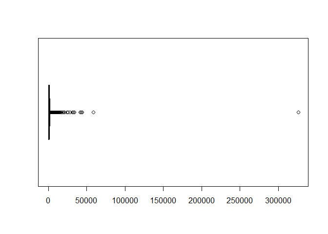

Proyecto 3 - Javier Ramos
================

# Análisis de deportes de resistencia

## 1. Carga de data

### 1.1 Librerias

``` r
library(quanteda)
```

    ## Package version: 3.0.0
    ## Unicode version: 10.0
    ## ICU version: 61.1

    ## Parallel computing: 12 of 12 threads used.

    ## See https://quanteda.io for tutorials and examples.

``` r
library(dplyr)
```

    ## 
    ## Attaching package: 'dplyr'

    ## The following objects are masked from 'package:stats':
    ## 
    ##     filter, lag

    ## The following objects are masked from 'package:base':
    ## 
    ##     intersect, setdiff, setequal, union

``` r
library(tidyverse)
```

    ## -- Attaching packages --------------------------------------- tidyverse 1.3.1 --

    ## v ggplot2 3.3.3     v purrr   0.3.4
    ## v tibble  3.1.0     v stringr 1.4.0
    ## v tidyr   1.1.3     v forcats 0.5.1
    ## v readr   1.4.0

    ## -- Conflicts ------------------------------------------ tidyverse_conflicts() --
    ## x dplyr::filter() masks stats::filter()
    ## x dplyr::lag()    masks stats::lag()

``` r
library(utf8)
library(cluster)
library(mclust)
```

    ## Package 'mclust' version 5.4.7
    ## Type 'citation("mclust")' for citing this R package in publications.

    ## 
    ## Attaching package: 'mclust'

    ## The following object is masked from 'package:purrr':
    ## 
    ##     map

``` r
library(e1071)
library(tidymodels)
```

    ## Registered S3 method overwritten by 'tune':
    ##   method                   from   
    ##   required_pkgs.model_spec parsnip

    ## -- Attaching packages -------------------------------------- tidymodels 0.1.3 --

    ## v broom        0.7.6      v rsample      0.1.0 
    ## v dials        0.0.9      v tune         0.1.5 
    ## v infer        0.5.4      v workflows    0.2.2 
    ## v modeldata    0.1.0      v workflowsets 0.0.2 
    ## v parsnip      0.1.6      v yardstick    0.0.8 
    ## v recipes      0.1.16

    ## -- Conflicts ----------------------------------------- tidymodels_conflicts() --
    ## x scales::discard()       masks purrr::discard()
    ## x dplyr::filter()         masks stats::filter()
    ## x recipes::fixed()        masks stringr::fixed()
    ## x dplyr::lag()            masks stats::lag()
    ## x mclust::map()           masks purrr::map()
    ## x rsample::permutations() masks e1071::permutations()
    ## x yardstick::spec()       masks readr::spec()
    ## x recipes::step()         masks stats::step()
    ## x tune::tune()            masks e1071::tune()
    ## * Use tidymodels_prefer() to resolve common conflicts.

``` r
library(kernlab)
```

    ## 
    ## Attaching package: 'kernlab'

    ## The following object is masked from 'package:scales':
    ## 
    ##     alpha

    ## The following object is masked from 'package:purrr':
    ## 
    ##     cross

    ## The following object is masked from 'package:ggplot2':
    ## 
    ##     alpha

### 1.2 Base de datos

``` r
endurance <- readRDS("endurance.rds")
```

## 2. Preprocesamiento de datos

### 2.1 Eliminar data

Se procederá a eliminar aquellos datos que no se utilizarán en el
análisis

``` r
endurance <- endurance[,!(colnames(endurance) %in% c("id", "athlete", "device_name", "has_heartrate","start_date_local", "records"))]
```

### 2.2 Eliminar datos vacíos

Se procederá a eliminar aquellas entidades que contengan atributos
vacíos

``` r
endurance <- na.omit(endurance)
```

### 2.4 Revisar estructura de los datos

Se transformará cada variable a su tipo correspondiente

``` r
endurance$type <- as.character(endurance$type)

endurance$calories <- as.numeric(as.character(endurance$calories))
endurance$distance <- as.numeric(as.character(endurance$distance))
endurance$elev_low <- as.numeric(as.character(endurance$elev_low))
endurance$elev_high <- as.numeric(as.character(endurance$elev_high))
endurance$max_speed <- as.numeric(as.character(endurance$max_speed))
endurance$moving_time <- as.numeric(as.character(endurance$moving_time))
endurance$elapsed_time <- as.numeric(as.character(endurance$elapsed_time))
endurance$average_speed <- as.numeric(as.character(endurance$average_speed))
endurance$total_elevation_gain <- as.numeric(as.character(endurance$total_elevation_gain))
```

### 2.5 Análisis de outliers

Se realizará un análisis para ver si hay presencia de valores atípicos
dentro de cada una de las variables

*1) Calories:*

``` r
boxplot(endurance$calories, horizontal = TRUE)
```

<!-- -->

Para adelantar trabajo, se iteraron 6 veces, llegando al siguiente
resultado:

``` r
attach(endurance)
it_calories <- calories[calories < 2099.5]
boxplot(it_calories, horizontal = TRUE)
```

<!-- -->

``` r
boxplot.stats(it_calories)
```

    ## $stats
    ## [1]    0  269  615 1001 2099
    ## 
    ## $n
    ## [1] 143289
    ## 
    ## $conf
    ## [1] 611.9446 618.0554
    ## 
    ## $out
    ## numeric(0)

Por lo tanto, los valores de la variable calories deben ser menores a
2099,5. Se procede a realizar el mismo análisis para la variable
distance.

*2) Distance:*

``` r
boxplot(endurance$distance, horizontal = TRUE)
```

<!-- -->

Para adelantar trabajo, se iteraron 13 veces, llegando al siguiente
resultado:

``` r
attach(endurance)
```

    ## The following objects are masked from endurance (pos = 3):
    ## 
    ##     average_speed, calories, distance, elapsed_time, elev_high,
    ##     elev_low, max_speed, moving_time, total_elevation_gain, type

``` r
it_distance <- distance[distance < 41550.5]
boxplot(it_distance, horizontal = TRUE)
```

<!-- -->

``` r
boxplot.stats(it_distance)
```

    ## $stats
    ## [1]     0.0  5914.2 11173.6 20167.3 41543.3
    ## 
    ## $n
    ## [1] 130403
    ## 
    ## $conf
    ## [1] 11111.24 11235.96
    ## 
    ## $out
    ## numeric(0)

Por lo tanto, la variable distance debe ser menor a 41.550,5.

*3) Elev\_low:*

``` r
boxplot(endurance$elev_low, horizontal = TRUE)
```

<!-- -->

Para adelantar trabajo, se iteraron 8 veces, llegando al siguiente
resultado:

``` r
attach(endurance)
```

    ## The following objects are masked from endurance (pos = 3):
    ## 
    ##     average_speed, calories, distance, elapsed_time, elev_high,
    ##     elev_low, max_speed, moving_time, total_elevation_gain, type

    ## The following objects are masked from endurance (pos = 4):
    ## 
    ##     average_speed, calories, distance, elapsed_time, elev_high,
    ##     elev_low, max_speed, moving_time, total_elevation_gain, type

``` r
it_elev_low <- elev_low[elev_low > -608.3 & elev_low < 1563.4]
boxplot(it_elev_low, horizontal = TRUE)
```

<!-- -->

``` r
boxplot.stats(it_elev_low)
```

    ## $stats
    ## [1] -558.5  214.6  591.0  754.0 1562.4
    ## 
    ## $n
    ## [1] 151584
    ## 
    ## $conf
    ## [1] 588.811 593.189
    ## 
    ## $out
    ## numeric(0)

Por lo tanto, la variable elev\_low debe ser mayor a -608,3 y menor a
1563,4.

*4) Elev\_high:*

``` r
boxplot(endurance$elev_high, horizontal = TRUE)
```

<!-- -->

Para adelantar trabajo, se iteraron 13 veces, llegando al siguiente
resultado:

``` r
attach(endurance)
```

    ## The following objects are masked from endurance (pos = 3):
    ## 
    ##     average_speed, calories, distance, elapsed_time, elev_high,
    ##     elev_low, max_speed, moving_time, total_elevation_gain, type

    ## The following objects are masked from endurance (pos = 4):
    ## 
    ##     average_speed, calories, distance, elapsed_time, elev_high,
    ##     elev_low, max_speed, moving_time, total_elevation_gain, type

    ## The following objects are masked from endurance (pos = 5):
    ## 
    ##     average_speed, calories, distance, elapsed_time, elev_high,
    ##     elev_low, max_speed, moving_time, total_elevation_gain, type

``` r
it_elev_high <- elev_high[elev_high > -499.2 &elev_high < 2007.5]
boxplot(it_elev_high, horizontal = TRUE)
```

<!-- -->

``` r
boxplot.stats(it_elev_high)
```

    ## $stats
    ## [1] -448.4  443.3  712.4 1068.9 2007.3
    ## 
    ## $n
    ## [1] 147422
    ## 
    ## $conf
    ## [1] 709.8256 714.9744
    ## 
    ## $out
    ## numeric(0)

Por lo tanto, la variable elev\_high debe ser mayor a -499,2 y menor a
2007,5.

*5) max\_speed:*

``` r
boxplot(endurance$max_speed, horizontal = TRUE)
```

<!-- -->

Para adelantar trabajo, se iteraron 5 veces, llegando al siguiente
resultado:

``` r
attach(endurance)
```

    ## The following objects are masked from endurance (pos = 3):
    ## 
    ##     average_speed, calories, distance, elapsed_time, elev_high,
    ##     elev_low, max_speed, moving_time, total_elevation_gain, type

    ## The following objects are masked from endurance (pos = 4):
    ## 
    ##     average_speed, calories, distance, elapsed_time, elev_high,
    ##     elev_low, max_speed, moving_time, total_elevation_gain, type

    ## The following objects are masked from endurance (pos = 5):
    ## 
    ##     average_speed, calories, distance, elapsed_time, elev_high,
    ##     elev_low, max_speed, moving_time, total_elevation_gain, type

    ## The following objects are masked from endurance (pos = 6):
    ## 
    ##     average_speed, calories, distance, elapsed_time, elev_high,
    ##     elev_low, max_speed, moving_time, total_elevation_gain, type

``` r
it_max_speed <- max_speed[max_speed < 27.37]
boxplot(it_max_speed, horizontal = TRUE)
```

<!-- -->

``` r
boxplot.stats(it_max_speed)
```

    ## $stats
    ## [1]  0.0  5.1 10.3 14.0 27.3
    ## 
    ## $n
    ## [1] 153487
    ## 
    ## $conf
    ## [1] 10.26411 10.33589
    ## 
    ## $out
    ## numeric(0)

Por lo tanto, la variable max\_speed debe ser menor a 27,37.

*6) max\_speed:*

``` r
boxplot(endurance$max_speed, horizontal = TRUE)
```

<!-- -->

Para adelantar trabajo, se iteraron 5 veces, llegando al siguiente
resultado:

``` r
attach(endurance)
```

    ## The following objects are masked from endurance (pos = 3):
    ## 
    ##     average_speed, calories, distance, elapsed_time, elev_high,
    ##     elev_low, max_speed, moving_time, total_elevation_gain, type

    ## The following objects are masked from endurance (pos = 4):
    ## 
    ##     average_speed, calories, distance, elapsed_time, elev_high,
    ##     elev_low, max_speed, moving_time, total_elevation_gain, type

    ## The following objects are masked from endurance (pos = 5):
    ## 
    ##     average_speed, calories, distance, elapsed_time, elev_high,
    ##     elev_low, max_speed, moving_time, total_elevation_gain, type

    ## The following objects are masked from endurance (pos = 6):
    ## 
    ##     average_speed, calories, distance, elapsed_time, elev_high,
    ##     elev_low, max_speed, moving_time, total_elevation_gain, type

    ## The following objects are masked from endurance (pos = 7):
    ## 
    ##     average_speed, calories, distance, elapsed_time, elev_high,
    ##     elev_low, max_speed, moving_time, total_elevation_gain, type

``` r
it_max_speed <- max_speed[max_speed < 27.37]
boxplot(it_max_speed, horizontal = TRUE)
```

<!-- -->

``` r
boxplot.stats(it_max_speed)
```

    ## $stats
    ## [1]  0.0  5.1 10.3 14.0 27.3
    ## 
    ## $n
    ## [1] 153487
    ## 
    ## $conf
    ## [1] 10.26411 10.33589
    ## 
    ## $out
    ## numeric(0)

Por lo tanto, la variable max\_speed debe ser menor a 27,37.

*7) moving\_time:*

``` r
boxplot(endurance$moving_time, horizontal = TRUE)
```

<!-- -->

Para adelantar trabajo, se iteraron 11 veces, llegando al siguiente
resultado:

``` r
attach(endurance)
```

    ## The following objects are masked from endurance (pos = 3):
    ## 
    ##     average_speed, calories, distance, elapsed_time, elev_high,
    ##     elev_low, max_speed, moving_time, total_elevation_gain, type

    ## The following objects are masked from endurance (pos = 4):
    ## 
    ##     average_speed, calories, distance, elapsed_time, elev_high,
    ##     elev_low, max_speed, moving_time, total_elevation_gain, type

    ## The following objects are masked from endurance (pos = 5):
    ## 
    ##     average_speed, calories, distance, elapsed_time, elev_high,
    ##     elev_low, max_speed, moving_time, total_elevation_gain, type

    ## The following objects are masked from endurance (pos = 6):
    ## 
    ##     average_speed, calories, distance, elapsed_time, elev_high,
    ##     elev_low, max_speed, moving_time, total_elevation_gain, type

    ## The following objects are masked from endurance (pos = 7):
    ## 
    ##     average_speed, calories, distance, elapsed_time, elev_high,
    ##     elev_low, max_speed, moving_time, total_elevation_gain, type

    ## The following objects are masked from endurance (pos = 8):
    ## 
    ##     average_speed, calories, distance, elapsed_time, elev_high,
    ##     elev_low, max_speed, moving_time, total_elevation_gain, type

``` r
it_moving_time <- moving_time[moving_time < 11799]
boxplot(it_moving_time, horizontal = TRUE)
```

<!-- -->

``` r
boxplot.stats(it_moving_time)
```

    ## $stats
    ## [1]     0  2141  3773  6004 11798
    ## 
    ## $n
    ## [1] 142862
    ## 
    ## $conf
    ## [1] 3756.852 3789.148
    ## 
    ## $out
    ## numeric(0)

Por lo tanto, la variable moving\_time debe ser menor a 11.799.

*8) elapsed\_time:*

``` r
boxplot(endurance$elapsed_time, horizontal = TRUE)
```

<!-- -->

Para adelantar trabajo, se iteraron 15 veces, llegando al siguiente
resultado:

``` r
attach(endurance)
```

    ## The following objects are masked from endurance (pos = 3):
    ## 
    ##     average_speed, calories, distance, elapsed_time, elev_high,
    ##     elev_low, max_speed, moving_time, total_elevation_gain, type

    ## The following objects are masked from endurance (pos = 4):
    ## 
    ##     average_speed, calories, distance, elapsed_time, elev_high,
    ##     elev_low, max_speed, moving_time, total_elevation_gain, type

    ## The following objects are masked from endurance (pos = 5):
    ## 
    ##     average_speed, calories, distance, elapsed_time, elev_high,
    ##     elev_low, max_speed, moving_time, total_elevation_gain, type

    ## The following objects are masked from endurance (pos = 6):
    ## 
    ##     average_speed, calories, distance, elapsed_time, elev_high,
    ##     elev_low, max_speed, moving_time, total_elevation_gain, type

    ## The following objects are masked from endurance (pos = 7):
    ## 
    ##     average_speed, calories, distance, elapsed_time, elev_high,
    ##     elev_low, max_speed, moving_time, total_elevation_gain, type

    ## The following objects are masked from endurance (pos = 8):
    ## 
    ##     average_speed, calories, distance, elapsed_time, elev_high,
    ##     elev_low, max_speed, moving_time, total_elevation_gain, type

    ## The following objects are masked from endurance (pos = 9):
    ## 
    ##     average_speed, calories, distance, elapsed_time, elev_high,
    ##     elev_low, max_speed, moving_time, total_elevation_gain, type

``` r
it_elapsed_time <- elapsed_time[elapsed_time < 14073]
boxplot(it_elapsed_time, horizontal = TRUE)
```

<!-- -->

``` r
boxplot.stats(it_elapsed_time)
```

    ## $stats
    ## [1]     0  2485  4332  7120 14072
    ## 
    ## $n
    ## [1] 140403
    ## 
    ## $conf
    ## [1] 4312.456 4351.544
    ## 
    ## $out
    ## numeric(0)

Por lo tanto, la variable elapsed\_time debe ser menor a 14.073.

*9) average\_speed:*

``` r
boxplot(endurance$average_speed, horizontal = TRUE)
```

<!-- -->

Para adelantar trabajo, se iteraron 8 veces, llegando al siguiente
resultado:

``` r
attach(endurance)
```

    ## The following objects are masked from endurance (pos = 3):
    ## 
    ##     average_speed, calories, distance, elapsed_time, elev_high,
    ##     elev_low, max_speed, moving_time, total_elevation_gain, type

    ## The following objects are masked from endurance (pos = 4):
    ## 
    ##     average_speed, calories, distance, elapsed_time, elev_high,
    ##     elev_low, max_speed, moving_time, total_elevation_gain, type

    ## The following objects are masked from endurance (pos = 5):
    ## 
    ##     average_speed, calories, distance, elapsed_time, elev_high,
    ##     elev_low, max_speed, moving_time, total_elevation_gain, type

    ## The following objects are masked from endurance (pos = 6):
    ## 
    ##     average_speed, calories, distance, elapsed_time, elev_high,
    ##     elev_low, max_speed, moving_time, total_elevation_gain, type

    ## The following objects are masked from endurance (pos = 7):
    ## 
    ##     average_speed, calories, distance, elapsed_time, elev_high,
    ##     elev_low, max_speed, moving_time, total_elevation_gain, type

    ## The following objects are masked from endurance (pos = 8):
    ## 
    ##     average_speed, calories, distance, elapsed_time, elev_high,
    ##     elev_low, max_speed, moving_time, total_elevation_gain, type

    ## The following objects are masked from endurance (pos = 9):
    ## 
    ##     average_speed, calories, distance, elapsed_time, elev_high,
    ##     elev_low, max_speed, moving_time, total_elevation_gain, type

    ## The following objects are masked from endurance (pos = 10):
    ## 
    ##     average_speed, calories, distance, elapsed_time, elev_high,
    ##     elev_low, max_speed, moving_time, total_elevation_gain, type

``` r
it1_average_speed <- average_speed[average_speed < 10.229]
boxplot(it1_average_speed, horizontal = TRUE)
```

<!-- -->

``` r
boxplot.stats(it1_average_speed)
```

    ## $stats
    ## [1]  0.000  2.675  3.575  5.696 10.227
    ## 
    ## $n
    ## [1] 153041
    ## 
    ## $conf
    ## [1] 3.562799 3.587201
    ## 
    ## $out
    ## numeric(0)

Por lo tanto, la variable average\_speed debe ser menor a 10,229.

*10) total\_elevetaion\_gain:*

``` r
boxplot(endurance$total_elevation_gain, horizontal = TRUE)
```

<!-- -->

Para adelantar trabajo, se iteraron 7 veces, llegando al siguiente
resultado:

``` r
attach(endurance)
```

    ## The following objects are masked from endurance (pos = 3):
    ## 
    ##     average_speed, calories, distance, elapsed_time, elev_high,
    ##     elev_low, max_speed, moving_time, total_elevation_gain, type

    ## The following objects are masked from endurance (pos = 4):
    ## 
    ##     average_speed, calories, distance, elapsed_time, elev_high,
    ##     elev_low, max_speed, moving_time, total_elevation_gain, type

    ## The following objects are masked from endurance (pos = 5):
    ## 
    ##     average_speed, calories, distance, elapsed_time, elev_high,
    ##     elev_low, max_speed, moving_time, total_elevation_gain, type

    ## The following objects are masked from endurance (pos = 6):
    ## 
    ##     average_speed, calories, distance, elapsed_time, elev_high,
    ##     elev_low, max_speed, moving_time, total_elevation_gain, type

    ## The following objects are masked from endurance (pos = 7):
    ## 
    ##     average_speed, calories, distance, elapsed_time, elev_high,
    ##     elev_low, max_speed, moving_time, total_elevation_gain, type

    ## The following objects are masked from endurance (pos = 8):
    ## 
    ##     average_speed, calories, distance, elapsed_time, elev_high,
    ##     elev_low, max_speed, moving_time, total_elevation_gain, type

    ## The following objects are masked from endurance (pos = 9):
    ## 
    ##     average_speed, calories, distance, elapsed_time, elev_high,
    ##     elev_low, max_speed, moving_time, total_elevation_gain, type

    ## The following objects are masked from endurance (pos = 10):
    ## 
    ##     average_speed, calories, distance, elapsed_time, elev_high,
    ##     elev_low, max_speed, moving_time, total_elevation_gain, type

    ## The following objects are masked from endurance (pos = 11):
    ## 
    ##     average_speed, calories, distance, elapsed_time, elev_high,
    ##     elev_low, max_speed, moving_time, total_elevation_gain, type

``` r
it_total_elevation_gain <- total_elevation_gain[total_elevation_gain < 1342]
boxplot(it_total_elevation_gain, horizontal = TRUE)
```

<!-- -->

``` r
boxplot.stats(it_total_elevation_gain)
```

    ## $stats
    ## [1]    0   29  191  554 1341
    ## 
    ## $n
    ## [1] 144924
    ## 
    ## $conf
    ## [1] 188.8211 193.1789
    ## 
    ## $out
    ## numeric(0)

Por lo tanto, la variable total\_elevation\_gain debe ser menor a 1.342.

Finalmente, se procede a filtrar la data según los valores encontrados

``` r
endurance <- filter(endurance ,endurance$calories < 2099.5)
endurance <- filter(endurance ,endurance$distance < 41550.5)
endurance <- filter(endurance ,endurance$elev_low > -608.3)
endurance <- filter(endurance ,endurance$elev_low < 1563.4)
endurance <- filter(endurance ,endurance$elev_high > -499.2)
endurance <- filter(endurance ,endurance$elev_high < 2007.5)
endurance <- filter(endurance ,endurance$max_speed < 27.37)
endurance <- filter(endurance ,endurance$moving_time < 11799)
endurance <- filter(endurance ,endurance$elapsed_time < 14073)
endurance <- filter(endurance ,endurance$average_speed < 10.229)
endurance <- filter(endurance ,endurance$total_elevation_gain < 1342)
```

### 2.6 Escalar datos

Se procede a realizar el escalamiento de datos para su posterior
análisis

``` r
id <- data.frame(endurance$type)
endurance <- endurance[,!(colnames(endurance) %in% c("type"))]
escal_data <- sapply(endurance, scale) %>% as.data.frame()
escal_data <- cbind.data.frame(escal_data, id)

escal_data2 <- escal_data
```

### 2.7 Selección aleatoria

Para poder ahorrar recursos en los análisis posteriores, se escogerán
datos de forma aleatoria

``` r
set.seed(500)
spescal_data <- escal_data[sample(nrow(escal_data), 26000),]
```

## 3. Procesamiento de datos

### 3.1 Análisis con SVM

Ahora que está escalada la data, se hará uso de un análisis con un
modelo SVM. Por lo tanto, se seguirán los siguientes pasos

### 3.2 Test y train

Se va a separar la data, una destinada al entrenamiento y la otra al
testeo. En este caso se detinará un 80% al entrenamiento.

``` r
data_split <- initial_split(spescal_data, prop = 0.8)

train_data <- training(data_split) 
test_data <- testing(data_split)
```

### 3.3 Crear Receta

Se crea la receta con la que se entrenará el modelo a implementar.

``` r
receta <- 
  recipe(endurance.type ~ ., data = train_data)
receta
```

    ## Data Recipe
    ## 
    ## Inputs:
    ## 
    ##       role #variables
    ##    outcome          1
    ##  predictor          9

``` r
summary(receta)
```

    ## # A tibble: 10 x 4
    ##    variable             type    role      source  
    ##    <chr>                <chr>   <chr>     <chr>   
    ##  1 calories             numeric predictor original
    ##  2 distance             numeric predictor original
    ##  3 elev_low             numeric predictor original
    ##  4 elev_high            numeric predictor original
    ##  5 max_speed            numeric predictor original
    ##  6 moving_time          numeric predictor original
    ##  7 elapsed_time         numeric predictor original
    ##  8 average_speed        numeric predictor original
    ##  9 total_elevation_gain numeric predictor original
    ## 10 endurance.type       nominal outcome   original

### 3.4 Crear modelo SVM

Se procede a crear el modelo SVM

``` r
fit_polySVM <- function(grado){
  
  mod <- svm_poly(degree = grado) %>% 
  set_engine("kernlab") %>% 
  set_mode("classification") %>% 
  translate()
  
  modelo_fit <- 
  workflow() %>% 
  add_model(mod) %>% 
  add_recipe(receta) %>% 
  fit(data = train_data)
  
  model_pred <- 
  predict(modelo_fit, test_data, type = "prob") %>% 
  bind_cols(test_data)
  
  model_pred %>% roc_auc(truth = spescal_data$endurance.type, .pred_0)
  return(model_pred %>% 
  roc_auc(truth = spescal_data$endurance.type, .pred_0))
}
```

Ahora se verá el resultado al variar el grado del polinomio

*Grado 1:*

``` r
#fit_polySVM(1)
```

*Grado 2:*

``` r
#fit_polySVM(2)
```

*Grado 3*:

``` r
#fit_polySVM(3)
```

# Conclusión

No pude terminar el análisis debido a que al poner el grado del
polinomio me aparecía un error.
